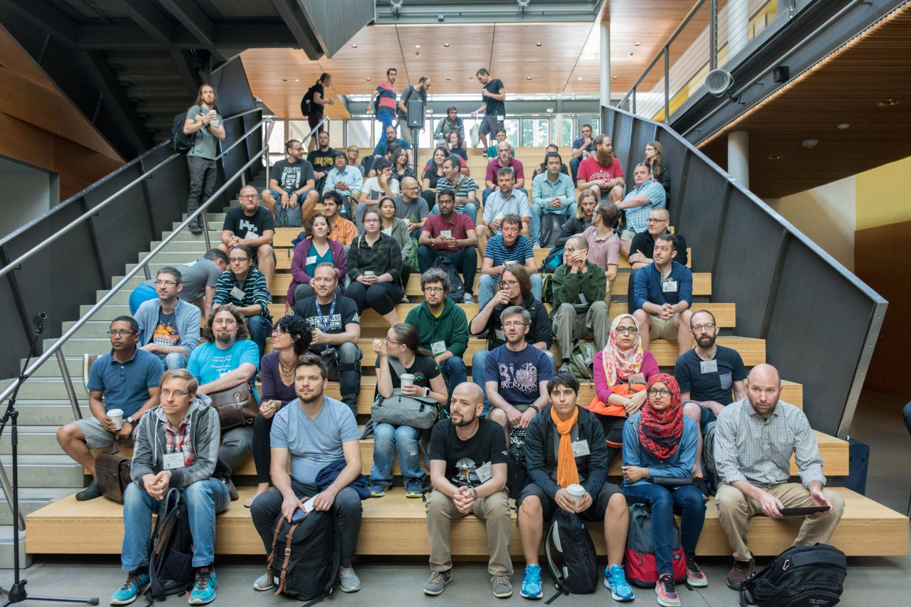
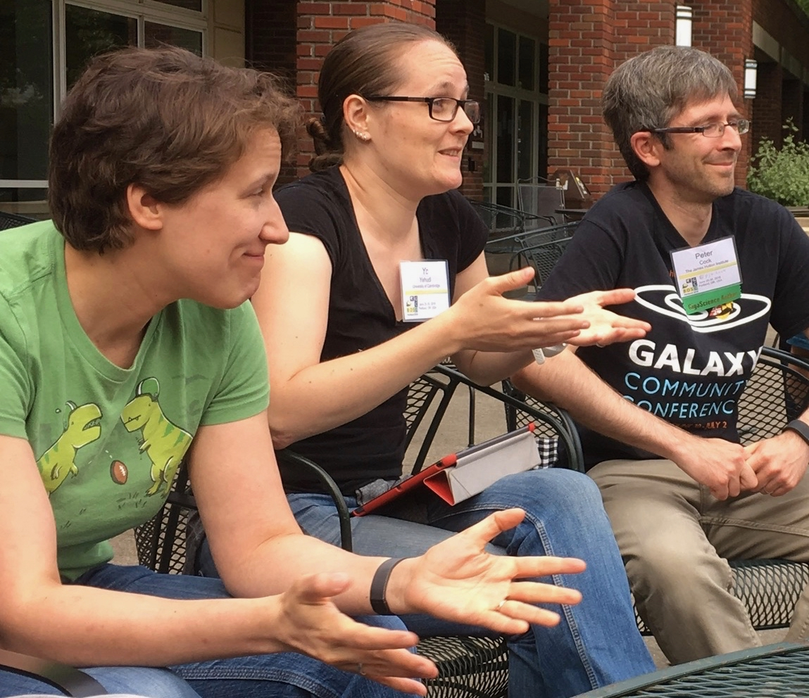
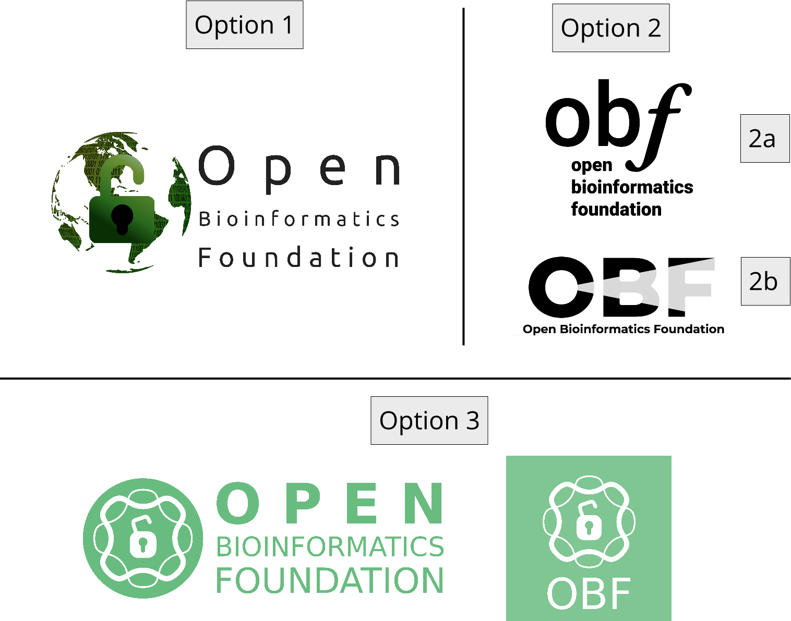
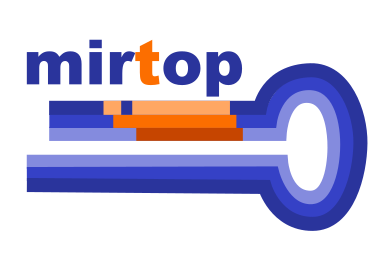

Having trouble viewing this email or looking for a permalink? [View this newsletter in your browser](https://github.com/OBF/newsletter/blob/master/newsletters/2018-07.md). Please note that on this occasion we've sent the email to the [bosc-announce](http://mailman.open-bio.org/mailman/listinfo/bosc-announce/), [open-bio-l](http://mailman.open-bio.org/mailman/listinfo/open-bio-l/), and [member lists](http://mailman.open-bio.org/mailman/listinfo/members/). Future mails will be sent only to bosc-announce and open-bio-l, so if you'd like to continue receiving newsletters, please subscribe to one or both of these lists. Note that they’re very low traffic and used exclusively (bosc-announce) or primarily (open-bio-l) for announcements only. 

# OBF Newsletter July 2018

Hi everyone and welcome to the Open Bioinformatics Foundation Newsletter. At GCCBOSC this year we had a fantastic Birds of a Feather meeting discussing [ways to improve community year-round for the OBF](https://news.open-bio.org/2018/07/09/following-up-from-boscs-obf-birds-of-a-feather-meeting/). One of the ideas was to create a newsletter, with the aim of allowing community members to provide updates on the open bioinformatics related projects they're working on or aware of. Right now this is very experimental, so we'd welcome feedback of any kind.

## OBF news

### GCCBOSC
 If you couldn't make it this year (and maybe even if you could) you can read the official report, enjoy [the brilliant photos taken by Berenice Batut](https://www.flickr.com/photos/134305289@N03/sets/72157695693844792/), or [fill out the GCCBOSC feedback survey](https://docs.google.com/forms/d/e/1FAIpQLSckB5ckoxvXf8UoheO9qOiGuWYsMRXWoOu_HkQ0RATzXmQZQA/viewform) - particularly if you _didn't_ attend!

Figure 1. Participants at the GCCBOSC CoFest (photo by [Bérénice Batut ](https://www.flickr.com/photos/134305289@N03/albums/72157695693844792/page3)under a [CC-BY-SA license](https://creativecommons.org/licenses/by-sa/2.0/))

Figure 2. Participants at the [OBF BoF](https://news.open-bio.org/2018/07/09/following-up-from-boscs-obf-birds-of-a-feather-meeting/) at GCCBOSC, led by Yo Yehudi. (Photo by Nomi Harris)

### OBF logo redesign
 [Voting on the OBF's new logo is now open!](https://goo.gl/forms/9cR0aqYNBpIDZ14K2) Three volunteers have created drafts of what could soon be the new logo for the OBF. [Vote now](https://goo.gl/forms/9cR0aqYNBpIDZ14K2) to have your say - and special thanks to Sarah Thursby, Chuck McCallum, and Aleix Lafita for their design efforts!

Figure 3. Three candidates for the new OBF logo, designed by community members. Vote for your favorite [here](https://docs.google.com/forms/d/e/1FAIpQLSexizXWITDKLoH5NIQNyf_V3k846RpOCaeBpMOjFVhBmJN0fQ/viewform?fbzx=2434550998028402000)!

## Community updates

### miRTop

Lorena Pantano [presented miRTop at GCCBOSC](https://gccbosc2018.sched.com/event/EiuN/mirtop-an-open-source-community-project-for-the-development-of-a-unified-format-file-for-mirna-data) this year, and already has some great updates, including an [official page for the miRNA annotation format, ](https://github.com/miRTop/mirGFF3)a brand-new listing on [FAIRsharing](https://fairsharing.org/bsg-s001218/), and a [winner for their logo competition](https://github.com/miRTop/mirtop/issues/29)!

### What is a pathway, anyway?

Lluís Revilla is looking for feedback on a personal project that aims to help standardize what a pathway is, or at least to compare the different database definitions and see their implications further down on the enrichment analysis tools using them. [The GSEAdv package](http://github.com/llrs/GSEAdv) analyses the properties of pathways of any database and will be released in Bioconductor when finished.

## Interesting links
*   [Mozilla Open Leaders](https://foundation.mozilla.org/opportunity/mozilla-open-leaders/) - Are you interested in learning how to work openly, or already work openly but want to boost your project and learn how to create a community around it? The Mozilla Open Leaders program is [accepting applications until the end of the month](https://foundation.mozilla.org/opportunity/mozilla-open-leaders/apply/) and is a great way to increase your project's openness, quality, and visibility.
*   [PLOS open source toolkit](https://channels.plos.org/open-source-toolkit), a curated set of articles that focuses on good quality open source tools and alternates between hardware and software. Many OBF projects could be highlighted here. [Submit an article](https://channels.plos.org/open-source-toolkit/open-source-toolkit-submit) (even non-PLOS) anytime.
*   [Mozilla Festival, especially the openness space](https://mozillafestival.org/spaces#Openness) - proposals for sessions at this internet-health oriented festival in London are open until the end of the month.
*   [Opencon](https://www.opencon2018.org/) - Applications to this open-oriented conference are now closed, but [you can still register to attend remotely](https://www.opencon2018.org/opencon_2018_live#intro).
*   Free [biology icons from Reactome, available freely under CC-BY. ](https://reactome.org/icon-lib)

## Future editions

### What format?

This is the first edition of this newsletter but we hope it won't be the last! We're still working out the details and have some questions we haven't ironed out yet. Should we accept content from any source, or only members and perhaps BOSC attendees or presenters? We don't want to overburden the newsletter curators. How often should the newsletter be? Monthly seems maybe too often - perhaps quarterly? If you have any thoughts we'd love to hear from you - or if you love writing and would like to help curate the newsletter, please let us know!

### Your content needed for the next issue!

If you have an exciting project update, request for feedback, or interesting link, [feel free to share it with us on GitHub](https://github.com/OBF/newsletter/issues/3), or discuss it offline if you're not sure whether or not your content is suitable - we're looking for content that's primarily open source / science related.
